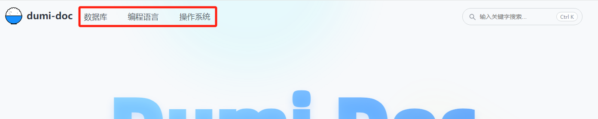
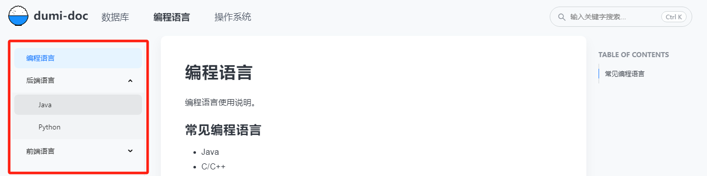

# Markdown Docs Static Website

静态Markdown文档网站项目。

## 配置说明
### 规范约定
1. .dumi/theme 文件夹下的内容为当前项目的主题文件，该文件夹不可删除。
2. .dumi/global.ts 文件内容为增添markdown支持的语法高亮，该文件不可删除。
3. .dumi/global.css 文件内容为全局样式定义，该文件不可删除。
4. .dumi/facicon.ico 文件内容为网站图标，如若需要更换则直接创建同名文件覆盖即可，该文件不可删除。
5. ./public/logo.png 文件内容为网站LOGO，标准为128x128，如若需要更换则直接创建同名文件覆盖即可。
6. 所有Markdown文件放置于 **./docs** 目录下统一管理。
7. 定义的目录层级建议最大不超过 **5** 层。
8. 文件夹与Markdown文件名约束 **全英文小写且遇见分词的情况使用短横线("-")分割**，禁止创建不包含任何markdown文件的空文件夹。
9. Markdown文件头部**Front Matter必不可少**，具体配置如下：
    ```text
    ---
    id: 1 (必填项！说明：markdown文件的id，后续配置菜单路径时需要对应。)
    toc: content (必填项！说明：markdown层次显示，固定为'content'。)
    title: 标题 (选填项！说明：markdown文档的标题，用于后续在<head>标签内插入<title>标签。)
    description: 描述 (选填项！说明：markdown文档的描述内容，用于后续在<head>标签内插入<meta>标签。)
    ---
    
    markdown的正文内容
    ```
### 网站名称配置
**配置文件**   
**_.dumirc.ts_**
```typescript
export default defineConfig({
  outputPath: 'build',
  // 主题配置项
  themeConfig: {
    name: 'Doc-Base', // 网站标题
    logo: '/logo.png', // 网站LOGO，文件放置于 ./public/logo.png
    ...
  }
});
```
### 网站首页配置
**配置文件**   
**_./docs/index.md_**
```text
---
title: 首页
hero:
  title: Knowledge  # 首页首屏区域大标题
  description: 开源知识库-静态Markdown文档网站 # 首页首屏区域简介文件，可以是HTML文本
  actions: # 首页首屏区域的操作按钮，最后一个按钮会作为主按钮展示
    - text: 数据库
      link: /database/database
    - text: 编程语言
      link: /language/language
features:   # 特性说明，每行3个的形式展示重点突出的特性
  - title: 更好的编译性能
    emoji: 🚀
    description: 通过结合使用Umi 4 MFSU、esbuild、SWC、持久缓存等方案，带来比 dumi 1.x 更快的编译速度
  - title: 内置全文搜索
    emoji: 🔍
    description: 不需要接入任何三方服务，标题、正文、demo 等内容均可被搜索，支持多关键词搜索，且不会带来产物体积的增加
  - title: 全新主题系统
    emoji: 🎨
    description: 为主题包增加插件、国际化等能力的支持，且参考Docusaurus为主题用户提供局部覆盖能力，更强更易用
  - title: 约定式路由增强
    emoji: 🚥
    description: 通过拆分路由概念、简化路由配置等方式，让路由生成一改 dumi 1.x 的怪异、繁琐，更加符合直觉
---
```
### 顶部导航栏配置
**1. 配置文件**  
**_.dumirc.ts_**  

**2. 页面样例**  

  

**3. 导航栏目录定义**  
- docs（文件夹）
  - database（文件夹）
    - ...
    - database.md（Markdown文件）
  - language（文件夹）
    - ...
    - language.md（Markdown文件）
  - os（文件夹）
    - ...
    - os.md（Markdown文件）

**4. 依据目录配置顶部导航栏**
```typescript
import { defineConfig } from 'dumi';

export default defineConfig({
  outputPath: 'build',
  // 主题配置项
  themeConfig: {
    // ...
    nav: [
      // title对应顶部导航栏的显示文字，link对应docs下第一级文件夹下的任一md文件（文件名与路径需要匹配）
      { title: '数据库', link: '/database/database' },
      { title: '编程语言', link: '/language/language' },
      { title: '操作系统', link: '/os/os' },
    ],
    // ...
  },
});
```

### 侧边栏菜单配置
**1. 配置文件**  
**_.dumi/theme/config/DocMenuData.ts_**

**2. 页面样例**



**3. 导航栏目录定义**
- docs（文件夹）
  - ...
  - language（文件夹）
    - server（文件夹）
      - java.md（Markdown文件）
      - python.md（Markdown文件）
    - web（文件夹）
      - java-script.md（Markdown文件）
      - type-script.md（Markdown文件）
    - language.md（Markdown文件）
  - ...

**4. 依据目录配置顶部导航栏**  

**Tips：** 更多层次依次按照相应规则定义即可。  

```typescript
const DocMenuData: DocMenuItem[] = [
  // ...
  /**
   * 一级菜单，包含/docs/xxx目录下的.md文件（类型为；doc）以及目录文件夹（类型为：menu）
   * 示例：文件夹名为 xxx 相对路径为 /docs/xxx
   *  { id: 1, parentId: 0, folder: 'xxx', type: "doc", title: "内容标题（即.md文件标题）", link: ''},
   *  或者
   *  { id: 1, parentId: 0, folder: 'xxx', type: "menu", title: "目录名称", link: ''},
   */
  { id: 1, parentId: 0, folder: 'language', type: "doc", title: "编程语言", link: ''},
  { id: 2, parentId: 0, folder: 'language', type: "menu", title: "后端语言", link: ''},
  { id: 3, parentId: 0, folder: 'language', type: "menu", title: "前端语言", link: ''},

  /**
   * 二级菜单，包含/docs/xxx/sss目录下的.md文件（类型为；doc）以及目录文件夹（类型为：menu）
   * 示例：文件夹名为 sss 相对路径为 /docs/xxx/sss 此处的folder与一级菜单对齐，仍为 xxx
   *  { id: 101, parentId: 1, folder: 'xxx', type: "doc", title: "内容标题（即.md文件标题）", link: ''},
   *  或者
   *  { id: 101, parentId: 1, folder: 'xxx', type: "menu", title: "目录名称", link: ''},
   */
  { id: 201, parentId: 2, folder: 'language', type: "doc", title: "Java", link: ''},
  { id: 202, parentId: 2, folder: 'language', type: "doc", title: "Python", link: ''},

  { id: 301, parentId: 3, folder: 'language', type: "doc", title: "JavaScript", link: ''},
  { id: 302, parentId: 3, folder: 'language', type: "doc", title: "TypeScript", link: ''},
  
  // ...
];

```

## 开发说明
### 开发环境
- IDE: 无要求，推荐使用 VSCode 或者 WebStorm
- node: v14+
- yarn: node版本匹配的yarn版本，非必需，也可以使用 npm 替代

### 编程语言
- TypeScript

### 依赖安装
```shell
yarn
```

### 运行
```shell
yarn start
```
### 构建
```shell
yarn build
```

### 部署
该项目为纯静态应用，构建成功后将 build 目录下的全部文件复制到服务器即可，推荐通过Nginx访问。

## 依赖说明
### 基础框架
- react: React 框架， v18
- react-dom: React 框架
- prop-types: React 框架扩展
- dumi: Dumi框架，v2.4.7

### UI框架
- antd: Ant Design，v5

### 脚手架
- create-dumi: Create Dumi Project 脚手架，推荐命令（在空文件夹中执行）： npx create-dumi

## LICENSE(许可协议)

MIT
