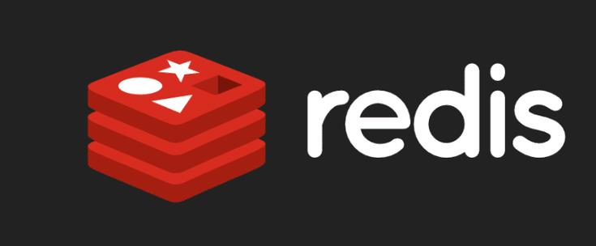

# Redis
  

详情:<https://baike.baidu.com/item/Redis/6549233?fr=ge_ala>  

&emsp;Redis（Remote Dictionary Server ），即远程字典服务，是一个开源的使用ANSI C语言编写、支持网络、可基于内存亦可持久化的日志型、Key-Value数据库，并提供多种语言的API。

## 定义
&emsp;redis是一个key-value存储系统。和Memcached类似，它支持存储的value类型相对更多，包括string(字符串)、list(链表)、set(集合)、zset(sorted set --有序集合)和hash（哈希类型）。这些数据类型都支持push/pop、add/remove及取交集并集和差集及更丰富的操作，而且这些操作都是原子性的。在此基础上，redis支持各种不同方式的排序。与memcached一样，为了保证效率，数据都是缓存在内存中。区别的是redis会周期性的把更新的数据写入磁盘或者把修改操作写入追加的记录文件，并且在此基础上实现了master-slave(主从)同步。  

&emsp;Redis 是一个高性能的key-value数据库。 redis的出现，很大程度补偿了memcached这类key/value存储的不足，在部 分场合可以对关系数据库起到很好的补充作用。它提供了Java，C/C++，C#，PHP，JavaScript，Perl，Object-C，Python，Ruby，Erlang等客户端，使用很方便。  

&emsp;Redis支持主从同步。数据可以从主服务器向任意数量的从服务器上同步，从服务器可以是关联其他从服务器的主服务器。这使得Redis可执行单层树复制。存盘可以有意无意的对数据进行写操作。由于完全实现了发布/订阅机制，使得从数据库在任何地方同步树时，可订阅一个频道并接收主服务器完整的消息发布记录。同步对读取操作的可扩展性和数据冗余很有帮助。  

&emsp;redis的官网地址，非常好记，是redis.io。（域名后缀io属于国家域名，是british Indian Ocean territory，即英属印度洋领地），Vmware在资助着redis项目的开发和维护。  

&emsp;从2010年3月15日起，Redis的开发工作由VMware主持。从2013年5月开始，Redis的开发由Pivotal赞助。

### 支持语言
许多语言都包含Redis支持

## 性能
下面是官方的bench-mark数据：  

&emsp;测试完成了50个并发执行100000个请求。  

&emsp;设置和获取的值是一个256字节字符串。  

&emsp;Linux box是运行Linux 2.6,这是X3320 Xeon 2.5 ghz。  

&emsp;文本执行使用loopback接口(127.0.0.1)。  

&emsp;结果:读的速度是110000次/s,写的速度是81000次/s 。
